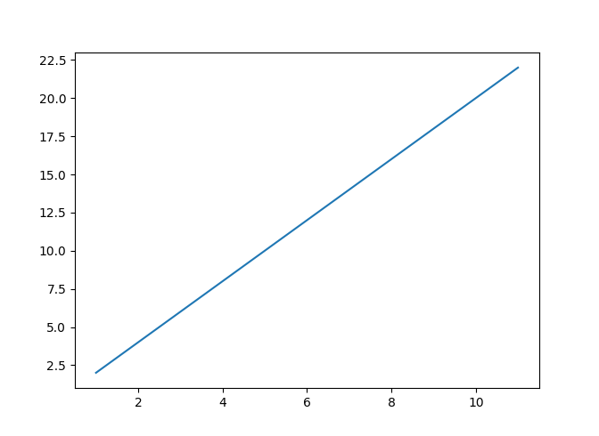
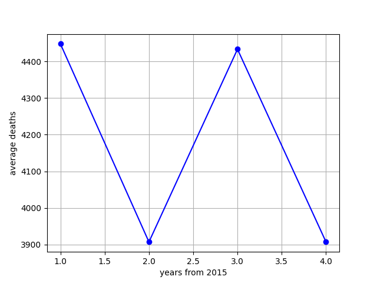

# Average-Death-Rate

**Average death rate count**

 

## The goal:

1. collect the data from a CSV file
2. count the ADR (average death rate) from years 2015-2019 and 2020+
2. change this data to float and add it into a list
3. create a python data plot on which OX are the years and OY ADR data

 

## Project idea:

 

## Tests:

1. Testing if matplotlib will plot a graph and make a png extension image:

