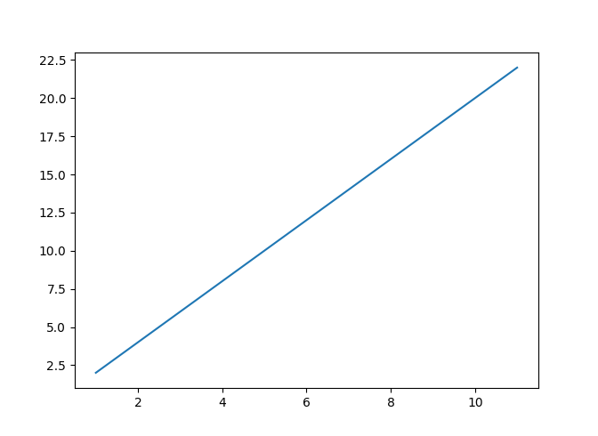
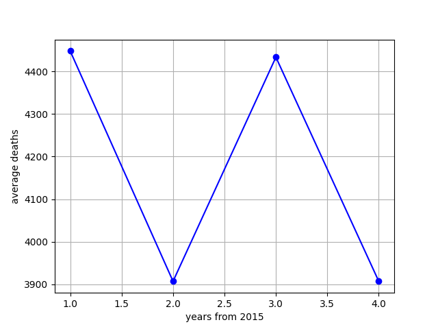
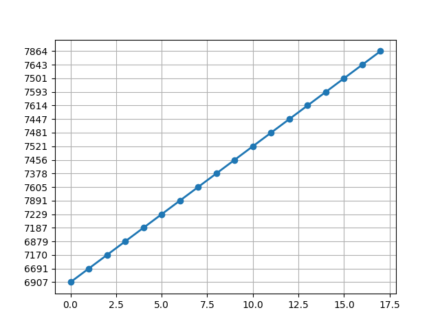
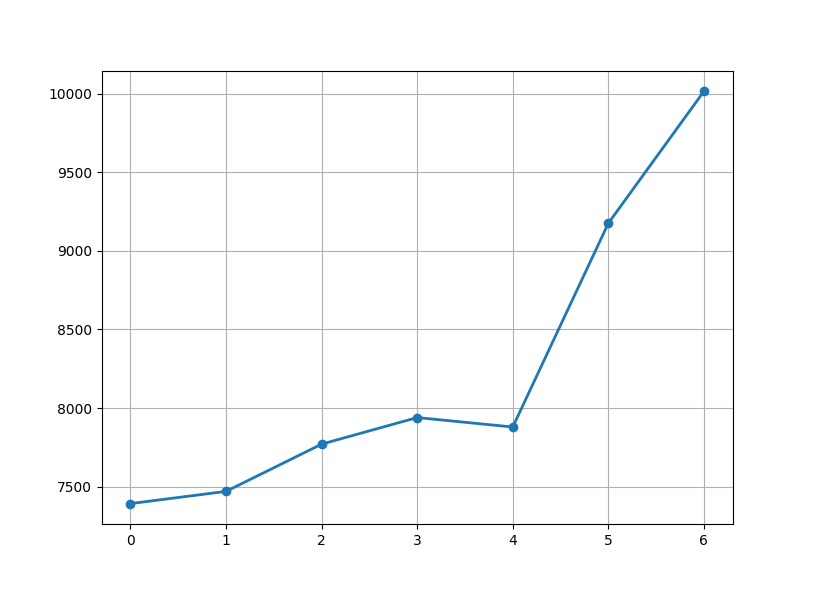

# Average-Death-Rate

**Average death rate count in Poland**

 

## The goal:

1. collect the data from a CSV file
2. count the ADR (average death rate) from years 2015-2019 and 2020+
2. change this data to float and add it into a list
3. create a python data plot on which OX are the years and OY ADR data

 

## Source:

The data source comes from here:<a href='https://dane.gov.pl/pl/dataset/1953/resource/28803,liczba-zgonow-zarejestrowanych-w-rejestrze-stanu-cywilnego-w-okresie-od-1-wrzesnia-2015-r-dane-tygodniowe/table'>
death statistics from 1 september 2015
</a>

 

## Demo Tests:

Just to show how does matplotlib work:

    
    

In the real project, I will have two plots on one displayed interface. Those are
divided into subplots, which in this case, there will be two of them.

 

The idea of the first plot. This data is from the actual source (not the one from
my code).

    
    

