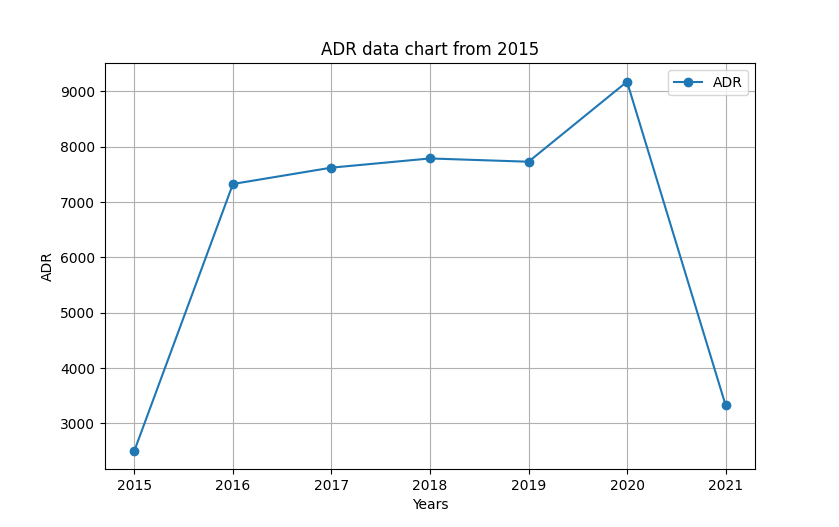
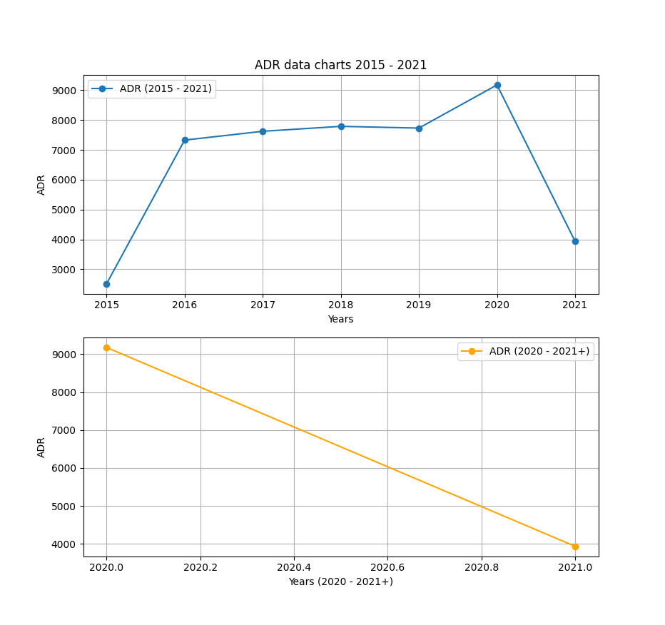

# Average-Death-Rate

**Displaying plot of death rates from past years in Poland**


<br>

## The goal

1. collect the data from a CSV file
2. count the ADR (Average Death Rate) from years 2015-2019 and 2020+
2. change this data to float and add it into a list
3. create a python data plot on which OX are the years and OY ADR data


<br>

## Data source

Data source:<a href='https://dane.gov.pl/pl/dataset/1953/resource/28803,liczba-zgonow-zarejestrowanych-w-rejestrze-stanu-cywilnego-w-okresie-od-1-wrzesnia-2015-r-dane-tygodniowe/table'>
death statistics from 1 september 2015
</a>


<br>

## Demo Tests

Just to show how does matplotlib work:
<p float="left">
    
    
</p>

In the real project, I will have two plots on one displayed interface. Those are
divided into subplots, which in this case, there will be two of them.


<br>

The idea of the first plot. This data is from the actual source (not the one from
my code).
<p>
    
    
</p>

<br>
<br>


## Project source 

Charts show data where data arrays are the same. First data array that goes on to
`OX` should have the same length as data array on `OY`, so basically `x = y` without
mentioning data types (except for `str` and `bool`). The few things to mention within the code in
src directory are here just in case that you want it to work:

<br>

### Debuggers

While checking if everything goes alright, I have used DBG's in my code and most of them
are turned off. To turn them on, you can simply just change the DBG state:

```python
    _DBG8_ = True                   # Other
    _DBG9_ = True                   # Standard debug
```


I have used `_DBG9_` to check if class inside of count.py was giving the right answers. Around the class
and programs inside of src directory, after each operation there is a debugger with an if. With a `print()`
function, I could see if the operation was made correctly and at the same time, I was going on to the next
line to see clearly if the next operation made was successful:

```python
    if (_DBG9_): print('ls =', ls, '\n\n')
```


<br>

### Screenshots and generating plots
All of these screenshots are made from a data science library to visualize data, matplotlib. On matplotlib, I
set label of `OX` axis to 'Years' and `OY` axis to 'ADR'. Of course, the data for 'Years' and 'ADR' was generated within
`Operations()` class inside of count.py file. Next, I needed to visualize the data on chart, so I used matplotlib
plot function to show data on both, `OX` and `OY` axis and decorated them a bit by adding marker argument to plot
function. I have also added a label to the graph:
```python
    plt.title("ADR data chart from 2015")
    plt.xlabel('Years')         # OX label: years from 2015
    plt.ylabel('ADR')           # OY label: ADR (short: average death rate)


    # 2. adding plot:
    plt.plot(ls_years, ls_main_data, label='ADR', marker='o')      # OX data, OY data,
```

To show the label of main graph, you need to add the following function:
```python
    plt.legend()
```

The final result:<br>



<br>

The data should be displayed on two plots (or subplots). To do that, `subplots()` method was used for this. There are 
two subplots, and one column. To divide this into two rows and one column, the `subplots()` takes two arguments which
describes the number of rows and columns:

```python
    fig, ax = plt.subplots(nrows=row_num, ncols=col_num)

    figure, (axis0, axis1) = plt.subplots(nrows=2, ncols=1)      # In this project, this was made using these args
```


`axis0` and `axis1` are describing axis that the plot is on. Then for plot method, we don't use `plt.plot()`, label or
titles because we assign different plots to different axis (in this case):

```python
    figure, (axis0, axis1) = plt.subplots(nrows=2, ncols=1)

    axis0.set_title("ADR data charts 2015 - 2021")
    axis0.set_xlabel('Years')         # OX label: years from 2015
    axis0.set_ylabel('ADR')           # OY label: ADR (short: average death rate)

    axis0.plot(ls_years, ls_main_data, label='ADR', marker='o')      # OX data, OY data
    axis0.legend()
    axis0.grid(True)
    
    
    
    axis1.set_xlabel('Years (2020 - 2021+)')         # OX label: years from 2020
    axis1.set_ylabel('ADR')           # OY label: ADR (short: average death rate)

    axis1.plot(ls_second_years, ls_main_data[5:], label='ADR', marker='o', color='orange')
    axis1.legend()
    axis1.grid(True)
    
    plt.show()
```

At the end, we give `plt.show()` method because we want to display the whole data chart. The final result is here:<br>




